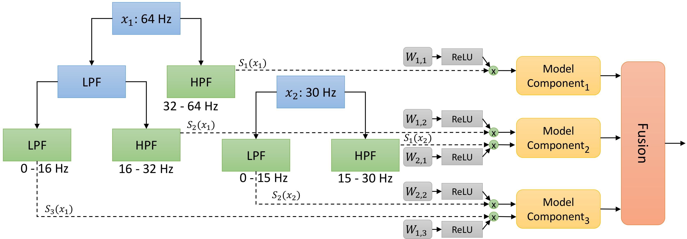

# MultiWave

The code for the paper: Deznabi, Iman, and Madalina Fiterau. "MultiWave: Multiresolution Deep Architectures through Wavelet Decomposition for Multivariate Time Series Prediction." Conference on Health, Inference, and Learning. PMLR, 2023. https://proceedings.mlr.press/v209/deznabi23a.html

Please cite this paper if you use the code in this repository as part of a published research project.

## Overview

MultiWave implements multiresolution deep architectures for time series prediction using wavelet decomposition. The repository includes code for data processing, model definitions, training routines, and evaluation utilities.



## Abstract

The analysis of multivariate time series data is challenging due to the various frequencies of signal changes that can occur over both short and long terms. Furthermore, standard deep learning models are often unsuitable for such datasets, as signals are typically sampled at different rates. To address these issues, we introduce MultiWave, a novel framework that enhances deep learning time series models by incorporating components that operate at the intrinsic frequencies of signals. MultiWave uses wavelets to decompose each signal into subsignals of varying frequencies and groups them into frequency bands. Each frequency band is handled by a different component of our model. A gating mechanism combines the output of the components to produce sparse models that use only specific signals at specific frequencies. Our experiments demonstrate that MultiWave accurately identifies informative frequency bands and improves the performance of various deep learning models, including LSTM, Transformer, and CNN-based models, for a wide range of applications. It attains top performance in stress and affect detection from wearables. It also increases the AUC of the best-performing model by 5\% for in-hospital COVID-19 mortality prediction from patient blood samples and for human activity recognition from accelerometer and gyroscope data. We show that MultiWave consistently identifies critical features and their frequency components, thus providing valuable insights into the applications studied.

## Repository Structure

- **MultiWave/main.py**: Entry point for training and evaluation. See [main.py](main.py).
- **MultiWave/DownloadProcessedWESADdata.py**: Script to download and extract the processed WESAD dataset.
- **MultiWave/Models/**: Contains model definitions, fusion functions, and training routines:
  - [`Fusions.py`](Models/Fusions.py)
  - [`Routines.py`](Models/Routines.py)
  - Other model-specific classes and wrappers.
- **MultiWave/utils/**: Provides utility functions for dataset handling, model training, loss computation, and wavelet transformations:
  - [`Dataset.py`](utils/Dataset.py)
  - [`ModelUtils.py`](utils/ModelUtils.py)
  - [`pytorchtools.py`](utils/pytorchtools.py)
  - [`WaveletUtils.py`](utils/WaveletUtils.py)

## Installation

1. **Clone the repository:**
   ```sh
   git clone https://github.com/username/MultiWave.git
   cd MultiWave
   ```

2. **Install required packages**: Make sure you have conda installed. Then, create and activate a new environment with the dependencies:
   ```sh
   conda env create -f environment.yml
   conda activate MultiWave
   ```

3. **Set up dataset**: Run the provided script to download and extract the WESAD dataset:
   ```sh
   python DownloadProcessedWESADdata.py
   ```

## Usage
**Training a Model**
To train a model, run the main script with appropriate arguments. For example:
```sh
python main.py --hs "[8, 8, 8, 8, 8, 0]" --d 32 --seed 123 --Fusion LinearFusion --Routine FeatNormLossWrapper --SubRoutine OnlyLastLoss --UseExtraLinear False --epochstotrain -1 --LW 0.1 --InitWs 0.5 --InitTemp 10.0 --Model Modelfreq_featMasks --Comp FCN_perchannel --NumLayers 1 --WaveletType db1 --LR 0.001
```
Refer to the argument definitions in main.py for available options.

## Evaluation
Model evaluation and logging are integrated with WandB. Once training completes, performance metrics such as accuracy, AUC, and confusion matrices (for classification) or MSE, MAE, and R2 (for regression) are printed and logged.

## Code Details

### Models and Routines
The `Models` folder defines various routines (e.g., `LossSwitches`, `CosineLosses`, `ResetModuleWrapper`) which handle training dynamics, loss weighting, and model optimization. These routines also interface with WandB for logging, as shown in the `wandblog` methods.

### Utilities
The `utils` folder contains helper functions:
- **Dataset.py**: Handles data loading and tensor conversion.
- **ModelUtils.py**: Contains training loops, loss functions, and evaluation functions.
- **WaveletUtils.py**: Provides utilities for wavelet transformations.

### Logging with WandB
Logging is integrated across training and evaluation routines. Functions such as `wandblog` and `wandbLossLogs` are used to track training progress and model performance.

## Citation
If you use this code in your research, please cite:

Deznabi, Iman, and Madalina Fiterau. "MultiWave: Multiresolution Deep Architectures through Wavelet Decomposition for Multivariate Time Series Prediction." Conference on Health, Inference, and Learning. PMLR, 2023.
